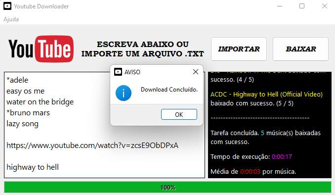
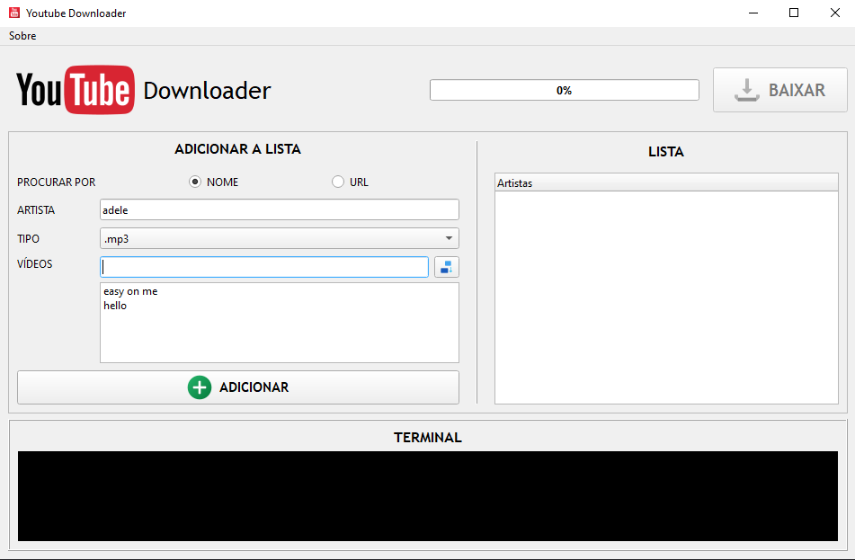
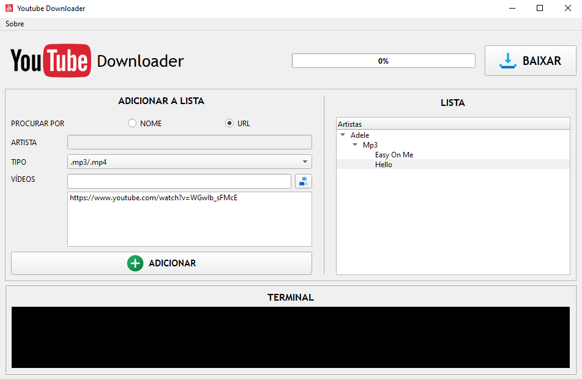
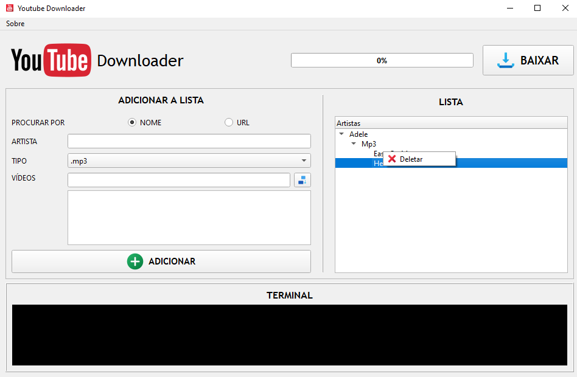

# ❤ YouTube Downloader

Aplicativo desktop (Windows) para baixar lista de vídeos do YouTube em formatos mp3 e mp4.

## 🕹 Como Usar
O app consiste em duas formas de buscas:

### Procurar por nome

Insira o nome do artista e escolha o formato, no campo `VÍDEOS` digite o nome do vídeo que deseja buscar e em seguida
clique no botão ao lado. 

É possível omitir o artista caso não ache necessário especificar, nesse caso as mídias inseridas
serão salvas com a chave 'Sem Artista'.

Obs: Na busca por nome o resultado é sempre o primeiro retornado, ou seja, ao não especificar um artista pode ser
retornado um resultado indesejado dependendo do quão genérico for a pesquisa.

### Procurar por URL

Escolha o formato e insira a URL desejada no campo `VÍDEOS` e em seguida clique no botão ao lado. 
É aceito tanto URLs para vídeos quanto também para playlists, desde que sigam o seguinte padrão:
- `https://www.youtube.com/watch?v=[ID DO VÍDEO]`
- `https://www.youtube.com/playlist?list=[ID DA PLAYLIST]`

Obs: O subdomínio `www.` não é necessário.

---

Você pode inserir quantos itens você quiser com a mesma configuração. Quando terminar, clique
no botão `ADICIONAR` e sua busca será processada e armazenada visualmente na lista ao lado.

Você pode continuar inserindo outras mídias de diferentes artistas e configurações, inclusive mesclando modos de busca,
para só depois começar a baixar.

Caso queira remover uma mídia adicionada tanto na lista de adição quanto na lista de download
basta usar o botão direito do mouse e clicar em `Deletar`.

## 📌 Atalhos 
- Botão download (CTRL + D).
- Botão adicionar (CTRL + A).
- Botão inserir mídia (ENTER quando estiver com o campo `VÍDEOS` em foco).

## ⚙ Funcionalidades
- Downloads são sempre feitos na maior qualidade possível.
- Terminal para manter usuário informado durante o processo.
- Mantem organizado os downloads seguindo a estrutura visual da lista.
- Caso algum erro ocorra durante o download é criado um arquivo de log com informações sobre o erro na pasta de destino.

## 🛠 Tecnologias
- Python
- PyQt6
- pytube
- Git e GitHub
