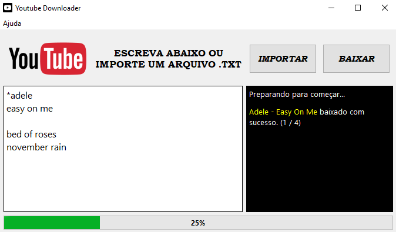
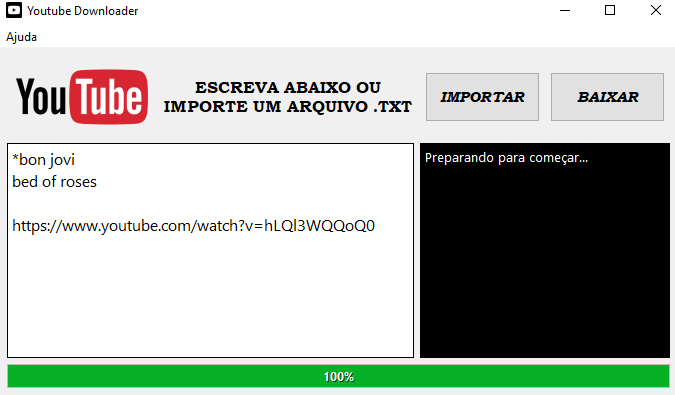

# ❤ YouTube Downloader Mp3

Aplicativo desktop (Windows) para baixar lista de vídeos do YouTube em formato mp3.

## 🕹 Como Usar
O aplicativo segue o seguinte algoritmo para baixar a lista:  
Use um "**\***" no começo da linha como prefixo e em seguida insira o nome do artista, logo abaixo insira o nome de uma
música por linha. Dessa forma o aplicativo irá procurar pelo nome do artista e pela música para garantir que você
terá exatamente o que queria.
Para alterar o artista basta na próxima linha começar novamente com um "**\***" e assim por diante.

Também é possível buscar apenas pelo nome da música ao colocar somente o nome dela. Caso haja inserido algum artista
anteriormente pule uma linha e escreva na próxima.

O último recurso é inserir apenas a url do vídeo. Respeitando o exemplo anterior, caso haja um artista na sequência pule
uma linha.

## ⚙ Funcionalidades

- É possível importar um arquivo .txt já preparado, ou previamente configurado para dentro do aplicativo.
- O terminal ao lado mantém o usuário informado durante o processo.
- Cria um arquivo .zip automaticamente ao final em um diretório escolhido pelo usuário.
- Faz uma previsão do tempo necessário para concluir a lista.

## 🛠 Tecnologias

- Python
- PyQt6
- pytube
- Git e GitHub
